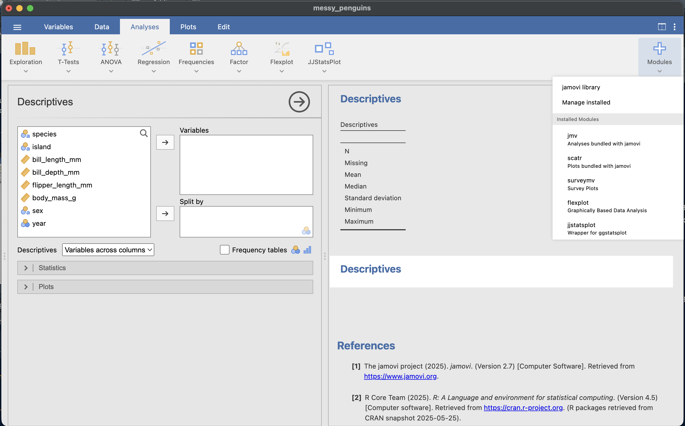
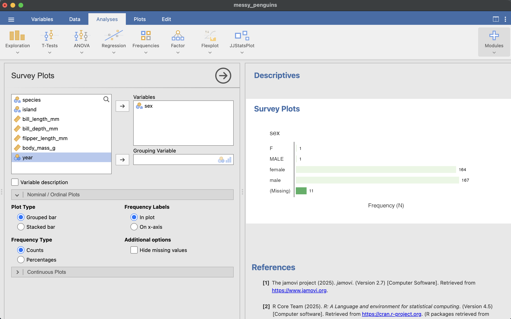
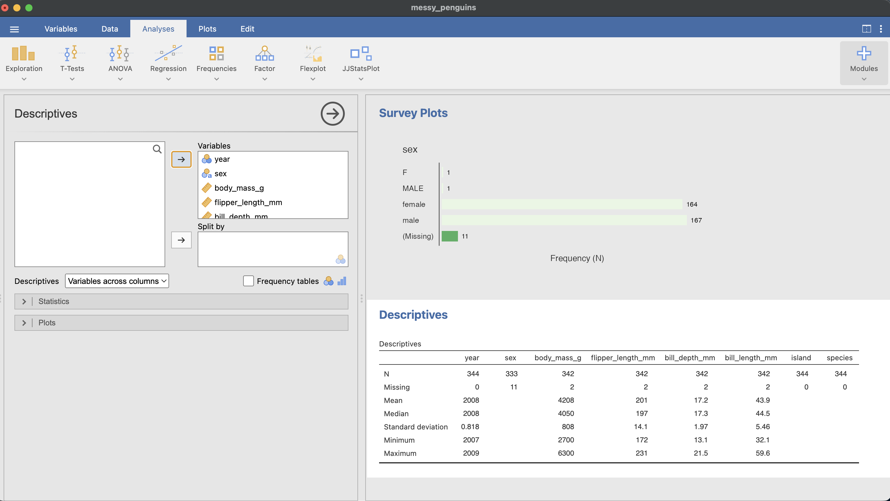
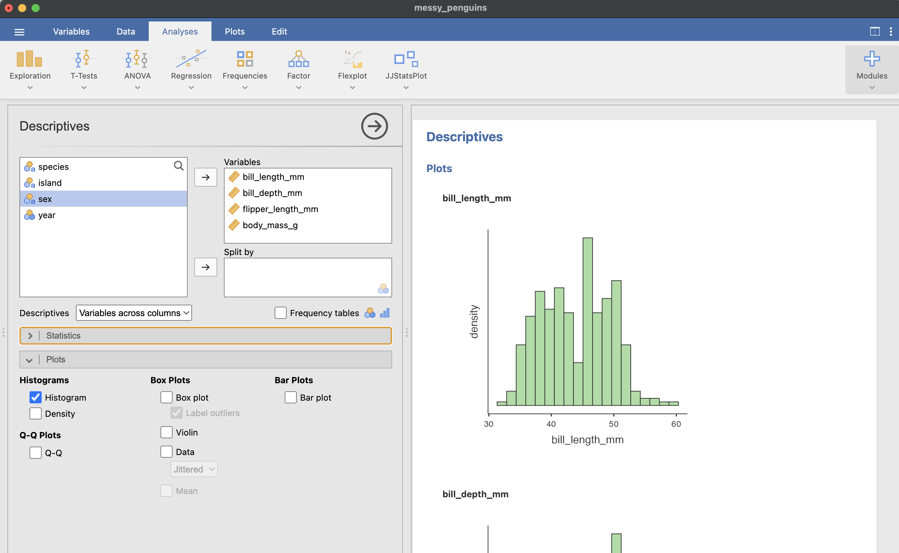
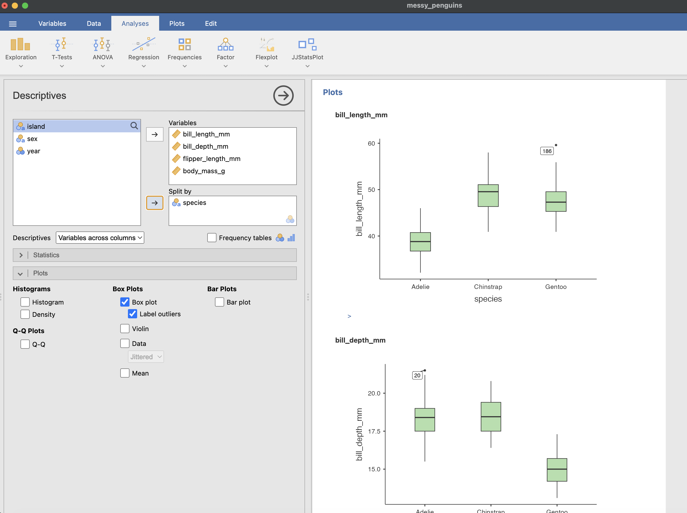
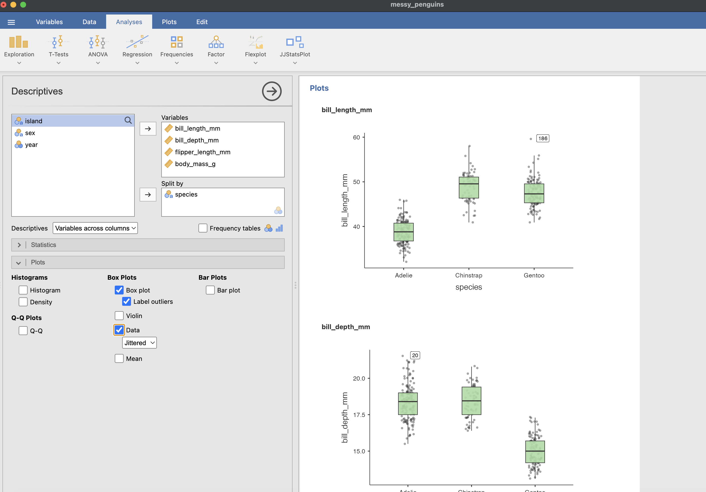
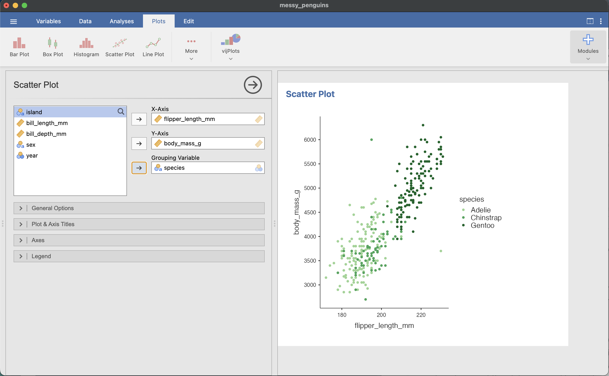

# jamovi

When you are checking your data for distribution problems and data entry errors, quick and dirty plots are the way to go. There are modules available to install that go beyond the basic plots in the Exploration/Descriptives tab. Use the BIG + button in the top right corner to install the `surveymv` module.

At this stage we are looking for

1.  missingness
2.  weird distributions
3.  values that could be errors

# run checks

## find missingness

JAMOVI is not as good as `DataExplorer` at allowing you to visualise missing values. Using the `surveymv` module, you can plot the frequencies for categorical variables and if you untick the option to hide missing values, it will include missing as a bar on your plot.

> note: this is a good way to find coding errors too

For numeric variables, you will need to use the Descriptives tab to get a table of summary stats, which includes missingness.

## check shape

To check the distribution of numeric variables you typically want to use a histogram. You can find this option in Descriptives -\> Plots

## find errors

### categorical

To catch coding errors, plot categorical variables as a bar plot. As described above, the `surveymv` module allows you to plot nominal/ordinal data as a grouped or stacked bar. Extra categories and misspelled cells will reveal themselves. 

### numeric

To catch other data entry errors, choose Descriptives and plot the raw data, first as a box plot... 

 

... and then with jittered points overlaid. Look for impossible values.

> note: these box plots seem to mislabel outliers

Making a scatterplot of variables you expect to be correlated and colouring points by another variable can make data entry errors stick out too. You can do this by choosing Plots -> Scatter

# summary

| The check | The question you're asking | The plot |
|:----------------|:--------------------------------------|:----------------|
| **Missing** | What isn't here — and is it random or patterned? | only for categorical `surveymv grouped bar` |
| **Mis-shaped** | What shape is each variable? Skew, ceiling/floor, bimodality? | `Descriptives histogram` |
| **Mis-coded** | Are the categories consistent, or full of typos and stray levels? | `surveymv grouped bar` |
| **Impossible** | Are any values out of bounds on their own? | `Descriptives boxplot + dots` |
| **Impossible together** | Are any values wrong *in combination*? | `Plots Scatter` |

: Six ways data can be wrong — and the plot that catches each {#tbl-datachecks}
