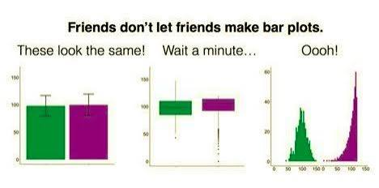

# the hidden curriculum of working with research data


Psychology students often complain about research methods courses. Psych programs make students do a lot of research methods and yet, when they get to Honours and are running their own project, students are often unprepared for the realities of dealing with real data. 

Research methods courses largely focus on teaching students how to design experiments and do inferential analysis. Students learn a lot about how to run and interpret statistical tests, but often very little about the process of getting real data ready for analysis. The toy datasets used in these courses are clean and tidy, seldom violate assumptions or contain errors and almost remove the need to plot. For Psych students, data visualisation is often an after thought. 

This is not your fault. Research methods lecturers and research supervisors just teach you what they know. But if you want your thesis to stand out of your marker's pile, investing some time in plotting your data will pay off. 


# why plot your data? 


## check your data

- summary statistics can hide wildly different distributions 
- errors (impossible values, coding issues) become visible
- you can see the shape (skew, outliers, bimodality, ceiling/floor effects)

## tell your story

- a good figure makes your effect obvious, it is easier for your marker to digest than a table, or summary stats in the text
- a figure that presents your findings transparently will make your thesis stand out in your marker's pile


This resource is designed to walk you through the process of making plots that check your data for errors and produce plots that tell your story. You can choose to use the open source GUI-based software JAMOVI, in combinatinon with the vijPlots module, or to use the `ggplot` package in RStudio. 


# ggplot

# plots to check your data

WHen you are checking your data for distribution problems and data entry errors, quick and dirty plots are the way to go. Packages like `DataExplorer` and `skimr` have great functions to make quick exploratory plots. 

At this stage we are looking for 

1. missingness
2. weird distributions
3. values that could be errors


```{r}
#| message: false
#| warning: false
#| 
library(tidyverse)
library(DataExplorer)
library(skimr)
library(ggrain)
library(ggeasy)


penguins <- read_csv(here::here("messy_penguins.csv"))


```


## missingness

```{r}

plot_missing(penguins)

```


## shape


```{r}


skim(penguins)

plot_histogram(penguins)


hist(penguins$flipper_length_mm)


```

## errors

To catch coding errors, plot categorical variables as a bar plot. Extra categories misspelled cells will reveal themselves. 


```{r}

plot_bar(penguins)

```


To catch other data entry errors, plot the raw data, first as a box plot and then with jittered points overlaid. Look for impossible values. 

```{r}
#| message: false
#| warning: false

penguins %>%
  ggplot(aes(x = species, y = flipper_length_mm)) +
  geom_boxplot() 


penguins %>%
  ggplot(aes(x = species, y = flipper_length_mm)) +
  geom_boxplot(outlier.shape = NA) +
  geom_jitter(width = 0.2)


```


Making a scatterplot of variables you expect to be correlated and colouring points by another variable can make data entry errors stick out too. 

```{r}
#| message: false
#| warning: false
penguins %>%
  ggplot(aes(x = flipper_length_mm, y = body_mass_g, colour = species)) +
  geom_point() +
  labs(title= "A very heavy chinstrap and an Adelie with flippers that are too long")
```


> *Note `DataExplorer::create_report(df)` automagically creates a report that includes lots of data checks. They won't all be relevant to all projects, but it is a good quick and dirty way to get many of the plots you need to check your data*


| The check | The question you're asking | The plot |
|:----------|:---------------------------|:---------|
| **Missing** | What isn't here — and is it random or patterned? | `plot_missing()` / `vis_miss()` |
| **Mis-shaped** | What shape is each variable? Skew, ceiling/floor, bimodality? | `skim()`, then `plot_histogram()` |
| **Mis-coded** | Are the categories consistent, or full of typos and stray levels? | bar plot (`plot_bar`) |
| **Impossible** | Are any values out of bounds on their own? | boxplot + jittered points |
| **Impossible together** | Are any values wrong *in combination*? | scatterplot (`geom_point`) |


: Six ways data can be wrong — and the plot that catches each {#tbl-datachecks}


# plots to tell a story

## why not a bar plot?

Published psychology articles are full of bar plots with standard error bars. Why? 

### bar plots are good because they...

- show differences in the mean between groups
- give your reader an idea of whether group might be significant


### bar plots are bad because they...

- can make wildly different data look similar
- hide bimodal, skew, outliers, ceiling/floor effects



Your marker will have lots of boring bar plots in their pile.  What if your plots were more interesting and informative?

## raincloud plots

A raincloud plot allows you to display the shape of the distribution, summary stats and raw points in a single plot. 

```{r}
#| message: false
#| warning: false
penguins %>%
  ggplot(aes(x = species, y = flipper_length_mm, fill = species)) +
  geom_rain() +
  theme_minimal() +
  guides(fill = "none") # removes the legend
```

Making it thesis worthy. Add dot transparency, fix the theme to be more apa-esque, add x and y axis labels, fix the text size. 

```{r}
#| message: false
#| warning: false
penguins %>%
  ggplot(aes(x = species, y = flipper_length_mm, fill = species)) +
  geom_rain(alpha = 0.5) + #a dd transparency
  theme_minimal() +
  guides(fill = "none") + # remove the legend
  theme_classic() +
  labs(x = "Penguin Species", y = "Flipper length (mm)") +
  easy_x_axis_labels_size(size = 12) +
  easy_y_axis_labels_size(size = 12) +
  easy_all_text_size(size = 14) 


  
```

Export as png to insert into your thesis. 

```{r}
ggsave("penguin_rain.png")

```

