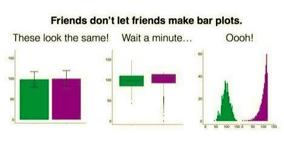

# ggplot

## why not a bar plot?

Published psychology articles are full of bar plots with standard error bars. Why? 

### bar plots are good because they...

- show differences in the mean between groups
- give your reader an idea of whether group might be significant


### bar plots are bad because they...

- can make wildly different data look similar
- hide bimodal, skew, outliers, ceiling/floor effects



Your marker will have lots of boring bar plots in their pile.  What if your plots were more interesting and informative?

Choosing a plot to tell a story about your data depends on on your question. Plotting the raw data, alongside summary stats is the most transparent approach. Here are some alternative options. 

## load packages

```{r}
#| message: false
#| warning: false
library(tidyverse)
library(ggrain) # for raincloud plots
library(ggeasy) # for making ggplot adjustments easy
library(ggcorrplot) # for correlation heatmaps
library(ggstats) # for likert plots
library(labelled) # for adding labels to variables

```

## read data

```{r}
#| message: false
#| warning: false

penguins <- read_csv(here::here("penguins.csv"))


```


# plot options

## scatterplot

If your question is primarily about the relation between variables, or how things are correlated, a scatter plot might be useful. Remember that you can color points by a 3rd variable. 

### basic plot

```{r}
#| message: false
#| warning: false

penguins |>
  ggplot(aes(x = body_mass_g, 
             y = bill_length_mm, 
             colour = sex)) +
  geom_point()

```

### thesis worthy

```{r}
#| message: false
#| warning: false
penguins |>
  ggplot(aes(x = body_mass_g, 
             y = bill_length_mm, 
             colour = sex)) +
  geom_point() +
   theme_classic() +
  labs(x = "Body Mass (g)", y = "Bill length (mm)") +
  easy_x_axis_labels_size(size = 12) +
  easy_y_axis_labels_size(size = 12) +
  easy_all_text_size(size = 14) 
```

### export

Save your plot as a .png file to insert into your thesis. 

```{r}
#| message: false
#| warning: false
ggsave("penguin_scatter.png")

```


## heatmap

If your questions is about how strongly variables are related, it can be useful to visualise that in a heatmap using the `ggcorrplot` package.

In the case of the penguin data, we might be interested in how the penguins body measurements correlate. 


### basic plot


```{r}

# select variables

penguin_measurements <- penguins |>
  select(starts_with("bill"), starts_with("flipper"), body_mass_g)

# get correlation matrix

corr <- cor(penguin_measurements, 
             method = "pearson",
                   use = "pairwise.complete.obs")


# plot the matrix as a heat map

ggcorrplot(corr)

```

### thesis worthy

Make the heatmap display only the upper triangle, print the R values in the tiles, remove legend, and adjust colour scheme. 

```{r}
ggcorrplot(corr,
    type = "upper",       # show upper triangle only (alt options "full", "lower")
    lab = TRUE, # print correlation values
    show.legend = FALSE, # remove legend
    colors = c("#0072B2", "white", "#D55E00"))  #adjust colours
        

```


### export

Save your plot as a .png file to insert into your thesis. 


```{r}
#| message: false
#| warning: false
ggsave("heatmap.png")
```


## raincloud plots

If your question is about group differences, you can illustrate how your groups differ usinga raincloud plot, which combines summary stats (median & quartiles), the shape of the distribution (density plot), and raw points in a single plot. 


### basic plot

```{r}
#| message: false
#| warning: false
#| 
penguins |>
  ggplot(aes(x = species, 
             y = flipper_length_mm, 
             fill = species)) +
  geom_rain()  
```


### thesis worthy

Remove the legend, fix the theme to be more APAesque, add dot transparency, add x and y axis labels, fix the text size. 

```{r}
#| message: false
#| warning: false
penguins |>
  ggplot(aes(x = species, 
             y = flipper_length_mm, 
             fill = species)) +
  geom_rain(alpha = 0.5) + #a dd transparency
  guides(fill = "none") + # remove the legend
  theme_classic() +
  labs(x = "Penguin Species", y = "Flipper length (mm)") +
  easy_x_axis_labels_size(size = 12) +
  easy_y_axis_labels_size(size = 12) +
  easy_all_text_size(size = 14) 

  
```

### export

Save your plot as a .png file to insert into your thesis. 

```{r}
#| message: false
#| warning: false
ggsave("penguin_rain.png")

```


## likert plot

Data from Likert scales is ordinal, not numeric. What is the difference? 

For ordinal data, there is an order to it, but the gaps between each level aren't necessarily equal. For example, we know that *Strongly Agree* is greater than *Agree*, but we can't be sure that the difference between the two is the same as the difference between *Neither agree nor disagree* and *Agree*. 

In contrast, for numeric data we know that the distance between consecutive units is the same. A 3200 g penguin is bigger than a 3000 g penguin. That difference is the same as two penguins who are 2500 g and 2700 g. 

It is really common for Likert scales to be labelled with numeric values (5 = Strongly Agree, 1 = Strongly Disagree) and then those labels are analysed as if they were numeric, despite the fact the values represent only order.  This can be problematic (see paper by [Liddell & Kruschke, 2018](https://papers.ssrn.com/sol3/Delivery.cfm?abstractid=2692323))

In terms of data visualisation, it can be more illuminating to plot the distribution of responses across levels of your scale, than to plot differences in average scores (which much like the #barbarplot argument above can be generated by many different patterns of data). 

I asked Claude to imagine that penguins could talk and to generate plausible survey responses from penguins in the Palmer dataset. They were asked questions about their swimming confidence, island preferences, climate anxiety, colony conflict and social support. 

> This data is generated by AI. Penguins don't answer survey questions.


```{r}
#| message: false
#| warning: false


survey <- read_csv("penguins_survey.csv")

codebook <- read_csv("survey_codebook.csv")

```

The first thing to note is that R thinks all the survey items are characters (i.e. text).  We know that they are ordered so want to convert to factors. We can do that in a single step using the `across()` function. 

```{r}
agree_levels <- c("Strongly disagree", "Disagree", "Neither agree nor disagree",
                  "Agree", "Strongly agree")

freq_levels  <- c("Never", "Rarely", "Sometimes", "Often", "Always")


# across the range of variable, apply factor to each one (.x) using levels agree vs freq

survey <- survey |>
        mutate(across(swim_1:climate_4, ~ factor(.x, levels = agree_levels)),
                across(conflict_1:social_4, ~factor(.x, levels = freq_levels)))


```


### basic plot

The `gglikert` function from the `ggstats` package plots the distribution of scale responses. 


It is also useful to be able to use the question text as a axis label rather than the less meaningful variable name. The `labelled` package makes it easy to add variable labels from a codebook


```{r}


# add variable labels from codebook

item_labels <- codebook |>
  select(item, text) |> 
  deframe() |>
  as.list()

var_label(survey) <- item_labels

# look_for(survey) prints a nice (but long) labelling summary

gglikert(survey, include = swim_1:swim_4)


```


### thesis worthy

To make it thesis worthy, you might ike to sort the items by agreement level, add totals for strongly agree + agree and strongly disagree and disagree, change the colour scheme and add a caption that notes the reverse scored item is presented as given. 

```{r}
#| message: false
#| warning: false
gglikert(survey,
         include = swim_1:swim_4,
         sort = "ascending",          # order items by level of agreement
         add_totals = TRUE,           # % disagree / % agree at each end
         labels_hide_below = 0.05,    # drop clutter from tiny segments
         y_label_wrap = 30) +         # wrap long item wording
  labs(title = "Swimming",
       caption = "swim_4 (foraging) is reversed; responses shown as given") +
  scale_fill_brewer(palette = "RdBu")
```


### making lots of plots

If you have a plot of plots to make, lets say one for each subscale, make a function. Here we are writing a function that takes items and a title as arguments. The details of the function live inside the curly brackets {}. 


```{r}
#| message: false
#| warning: false
plot_subscale <- function(items, title) {
  gglikert(survey, include = {{ items }},
           sort = "ascending", add_totals = TRUE,
           labels_hide_below = 0.05, y_label_wrap = 40) +
    labs(title = title) +
  scale_fill_brewer(palette = "RdBu")
}

```


::: {.panel-tabset}
## swimming

```{r}
#| message: false
#| warning: false

plot_subscale(swim_1:swim_4, "Swimming")

```

## island

```{r}
#| message: false
#| warning: false

plot_subscale(island_1:island_4, "Island")
```

## climate

```{r}
#| message: false
#| warning: false

 plot_subscale(climate_1:climate_4, "Climate")

```

## conflict

```{r}
#| message: false
#| warning: false

plot_subscale(conflict_1:conflict_4, "Conflict")
```

## social

```{r}
#| message: false
#| warning: false

plot_subscale(social_1:social_4, "Social")

```


:::


### plots by group

If you are interested in the distribution of responses as a function of group, you can facet by group using facet_rows. 

```{r}
#| message: false
#| warning: false

gglikert(survey,
         include = swim_1:swim_4,
         sort = "ascending", 
         y = "species",
         facet_rows = vars(.question),
         facet_label_wrap = 25, # how many char before label warp
         add_totals = TRUE) + 
         theme(strip.background   = element_rect(fill = "white", colour = NA),
           strip.text.y.right = element_text(angle = 0, colour = "black", hjust = 0)) +
  labs(title = "Swimming",
       caption = "Note: swim_4 (foraging) is reversed; responses shown as given") +
  scale_fill_brewer(palette = "RdBu")


```


### export

Save your plot as a .png file to insert into your thesis. 


```{r}
#| message: false
#| warning: false

ggsave("penguin_likert.png")

```


# your turn

Use this link to access a [Posit Cloud project](https://posit.cloud/content/12942403) where you can try this out with your own data. Use script_your_data.R to read your data and play around with plotting to check your data and tell your story. All the packages you need are already installed. Just sign up for a Cloud account using your email account. 